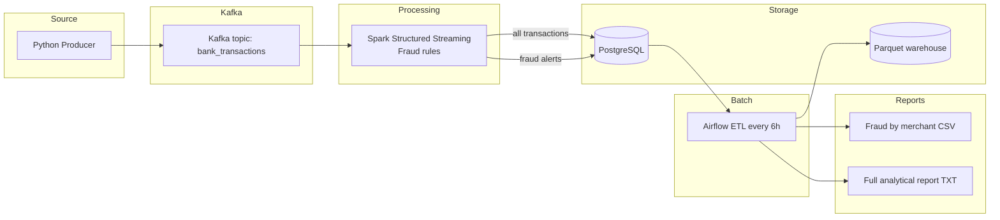

# Architecture Diagram

```mermaid
flowchart LR
  subgraph Source
    Producer[Python Producer]
  end
  subgraph Kafka
    Topic[Kafka topic: bank_transactions]
  end
  subgraph Processing
    Spark[Spark Structured Streaming\nFraud rules]
  end
  subgraph Storage
    Postgres[(PostgreSQL)]
    Warehouse[(Parquet warehouse)]
  end
  subgraph Batch
    Airflow[Airflow ETL every 6h]
  end
  subgraph Reports
    MerchantCSV[Fraud by merchant CSV]
    FullReport[Full analytical report TXT]
  end

  Producer --> Topic --> Spark
  Spark -->|all transactions| Postgres
  Spark -->|fraud alerts| Postgres
  Postgres --> Airflow
  Airflow --> Warehouse
  Airflow --> MerchantCSV
  Airflow --> FullReport
```
